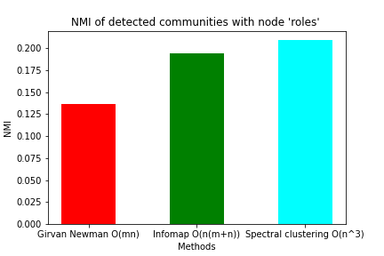

# biological_community_detection

#### The aim of this project is to evaluate community detection algorithms on synthetic and cortical networks.

### Full course notes on the topic can be found here: https://docs.google.com/document/d/19IIG6hELzsp0FxOnjmT8YMZQAnOht_8BsvzqTOSWGfY/edit?usp=sharing

#### The algorithms will be evaluated with:
1. The normalised mutual information: 
2. The modularity:

##### These scores are with respect to the ground truth communities. 

## Baseline reasults

#### Below show the variatoon if Normalised mutual information and Modularity for the synthetic LFR graph with varying number of nodes andmixing perameter between 0-1.

##### LFR synthetic graph with ground state communities colored.

| Normalised mutual information      | Modularity     |
| -------------- | -------------- |
|    |    |
| |  |
| |  |

## Reasults of community detection conmnectome cortical netowrks.
##### A 'connectome' is a specific, cell-to-cell mapping of axonal tracts between neurons, created from cellular data like electron microscopy. 

### C elegans are of huge interest to the feild of bioinformatics as they provide a link between nervous system connectivity and machanical movement. This was demonstrated https://www.youtube.com/watch?v=YWQnzylhgHc where the connectome was combined with "muscle" movements of the worm with some simple algorithms> these were translated into a robot.

### Below shows the connectome of a c eligan projected onto the body of the worm. 

Eeach node holds some metadata in the form of:

- cell_id : auto-inc cell ID
- cell_name : official cell name, from original brenner paper
- cell_class : an attempt at determining the cell class
- soma_pos : position along the body axis, range : [0, 1]
- role: text string of Motor, sensory, interneuron
- neurotransmitter: text string of type of neurotransmitter

### Below is the network 

### An application of communty finding was applied tot he this connectome to investigate the community structure of the netwrok with respect to its node metadata. 
#### Below is an evaluation of the detected communities overlap with the node metadata treated as communities. 

### It can be seen that each method predicts around 5 communities for the connectome. There were 3 cell role types and 7 Neurotransmitter types so it seemed reasonable to compare this node metadata to the found communites. 

### It may be reasonable to imagine come community strcture within Motor, Sensory and Interneuron nodes. 

| Cell role     | Neurotransmitter     |
| -------------- | -------------- |
|    |    |

References:

1. Fortunato, S., & Hric, D. (2016). Community detection in networks: A user guide. In arXiv [physics.soc-ph]. http://arxiv.org/abs/1608.00163

2. Fortunato, S. (2009). Community detection in graphs. In arXiv [physics.soc-ph]. http://arxiv.org/abs/0906.0612

3. https://neurodata.io/project/connectomes/