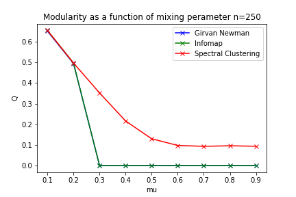

# biological_community_detection

#### The aim of this project is to evaluate community detection algorithms on synthetic and cortical networks.

### Full course notes on the topic can be found here: https://docs.google.com/document/d/19IIG6hELzsp0FxOnjmT8YMZQAnOht_8BsvzqTOSWGfY/edit?usp=sharing

#### The algorithms will be evaluated with:
1. The normalised mutual information: 
2. The modularity:

##### These scores are with respect to the ground truth communities. 

## Baseline reasults

#### Below show the variatoon if Normalised mutual information and Modularity for the synthetic LFR graph with varying number of nodes andmixing perameter between 0-1.

##### LFR synthetic graph with ground state communities colored.

| Normalised mutual information      | Modularity     |
| -------------- | -------------- |
|    |    |
| |  |
| |  |

## Reasults of community detection cortical netowrks.

#### Below is an evaluation of the detected communities overlap with the node metadata treated as communities. 

| Cell role     | Neurotransmitter     |
| -------------- | -------------- |
|    |    |

References:

1. Fortunato, S., & Hric, D. (2016). Community detection in networks: A user guide. In arXiv [physics.soc-ph]. http://arxiv.org/abs/1608.00163

2. Fortunato, S. (2009). Community detection in graphs. In arXiv [physics.soc-ph]. http://arxiv.org/abs/0906.0612
