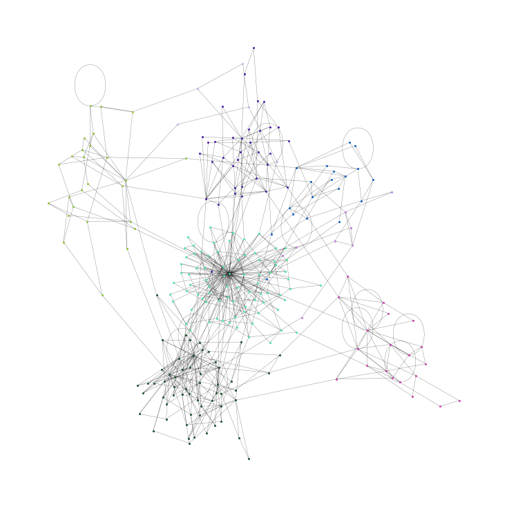
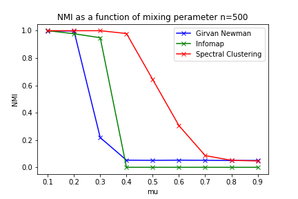

# Biological Community Detection 

#### The aim of this project is to evaluate community detection algorithms on synthetic and C. elegans connectome networks.

* * Full course notes on the topic can be found here: https://docs.google.com/document/d/19IIG6hELzsp0FxOnjmT8YMZQAnOht_8BsvzqTOSWGfY/edit?usp=sharing

#### The algorithms will be evaluated with:
1. The normalised mutual information: 
2. The modularity:

##### These scores are with respect to the ground truth communities. 

## Baseline reasults

#### Below show the variatoon if Normalised mutual information and Modularity for the synthetic LFR graph with varying number of nodes andmixing perameter between 0-1.

##### LFR synthetic graph with ground state communities colored.

| Normalised mutual information      | Modularity     |
| -------------- | -------------- |
|    |    |
| |  |
| |  |

## Real world netwroks : Community detection for conmnectome cortical netowrks.

#### The microscopic worm C. elegans has 302 neurons with approximately 8,000 synapses and is the only model organism in which the wiring diagram of the entire nervous system is almost completely known.

##### A 'connectome' is a specific, cell-to-cell mapping of axonal tracts between neurons, created from cellular data like electron microscopy. 

##### C elegans are of huge interest to the feild of bioinformatics as they provide a link between nervous system connectivity and machanical movement. This was demonstrated https://www.youtube.com/watch?v=YWQnzylhgHc where the connectome was combined with "muscle" movements of the worm with some simple algorithms> these were translated into a robot.

#### Below shows the connectome of a c eligan projected onto the body of the worm. 

Eeach node holds some metadata in the form of:

- cell_id : auto-inc cell ID
- cell_name : official cell name, from original brenner paper
- cell_class : an attempt at determining the cell class
- soma_pos : position along the body axis, range : [0, 1]
- role: text string of Motor, sensory, interneuron
- neurotransmitter: text string of type of neurotransmitter

#### Below is the network in our code environment. 
> The data contained information on the direction and number of connections via chemical synapses and electrical junctions among neurons in the entire nervous system as well as one-dimensional spatial positions of neurons (i.e., somal centers) along the anterior-posterior body axis. All connections between non-pharyngeal neurons were included except those of CANL/R and VC6, which did not have obvious synapses. Consequently, the model connectome had 279 neurons.

#### An application of communty finding was applied tot he this connectome to investigate the community structure of the netwrok with respect to its node metadata. 
#### Below is an evaluation of the detected communities overlap with the node metadata treated as communities. 

#### It can be seen that each method predicts around 5 communities for the connectome. There were 3 cell role types and 7 Neurotransmitter types so it seemed reasonable to compare this node metadata to the found communites. 

#### It may be reasonable to imagine come community strcture within Motor, Sensory and Interneuron nodes. 

| Cell role     | Neurotransmitter     |
| -------------- | -------------- |
|    |    |

##### Here we can see that both the Cell Role and Neurotransmitter status of each node are not aligned with the community strucutre in connectivity of the connectome. There is existance of weak community structure but of weak biological significance. 

##### Given that most bilateral neuronal pairs of C. elegans have similar functional roles [5] and accepting the principle of structure-function association in evolutionary biology [6], structural clusters driven by an appropriate community detection method should not assign each member of a bilateral neuronal pair to a different structural cluster.

# Community struacutre of CNN vs GNN

#### Of greater interest with may give evidence of current neural network architectures being poor representations of simple connectomes and graph neural networks being more of a better fit when moving towards biologically inspired artificail neural networks. 

> Because brain structure is closely related to function, an understanding of the topological structure of neuronal organiza- tion in the brain is crucial for insight into how neuronal networks perform their precise functions. Understnading community structure in the brain is of critical importance because it provides valuable clues regarding the relationship between anatomical clusters and functional circuits.

References:

1. Fortunato, S., & Hric, D. (2016). Community detection in networks: A user guide. In arXiv [physics.soc-ph]. http://arxiv.org/abs/1608.00163

2. Fortunato, S. (2009). Community detection in graphs. In arXiv [physics.soc-ph]. http://arxiv.org/abs/0906.0612

3. https://neurodata.io/project/connectomes/

4. Topological Cluster Analysis Reveals the Systemic Organization of the Caenorhabditis elegans Connectome Y Sohn, MK Choi, YY Ahn, J Lee… - PLoS computational …, 2011 - journals.plos.org https://www.ncbi.nlm.nih.gov/pmc/articles/PMC3098222/

5. White JG, Southgate E, Thomson JN, Brenner S (1986) The Structure of the Nervous System of the Nematode Caenorhabditis elegans. Phil Trans R Soc Lond B 314: 1–340.

6. Kandel ER, Schwartz JH, Jessell TM (2000) Principles of Neural Science. New York: McGraw-Hill. pp 983–997.