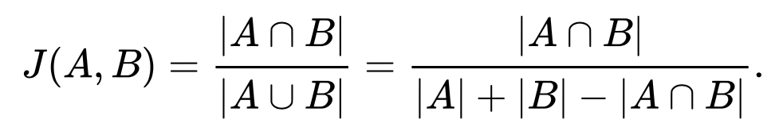
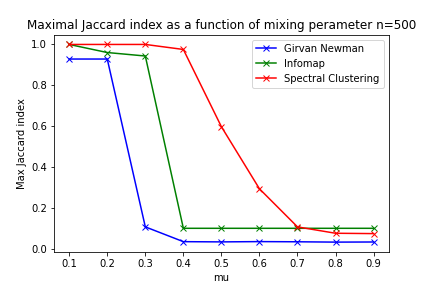
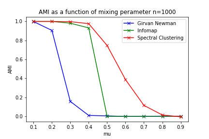
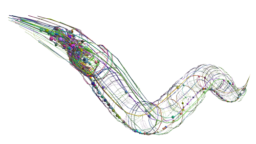

# Biological Community Detection 

- [Biological Community Detection](#biological-community-detection)
     
  - [Baseline reasults](#baseline-reasults)
       
  - [Real world netwroks : Community detection for conmnectome cortical netowrks.](#real-world-netwroks--community-detection-for-conmnectome-cortical-netowrks)
      
  - [Next steps](#next-steps)
   
#### The aim of this project is to evaluate community detection algorithms on synthetic and C. elegans connectome networks.

* Full course notes on the topic can be found here: https://docs.google.com/document/d/19IIG6hELzsp0FxOnjmT8YMZQAnOht_8BsvzqTOSWGfY/edit?usp=sharing
##### Baseline script found at `Processing/LFR_plot_creation.ipynb`
##### C_ELigan script found at `Processing/Worm_cortex.ipynb`
##### Util fucntions found at `Processing/utils.py`

#### The algorithms will be evaluated with:

| Normalised mutual information (NMI)      | Modularity  (Q)   | Adjusted mutual information  (AMI)   | Maximum Jaccard index (MaxJaccard)   |
| -------------- | -------------- |-------------- |-------------- |
|    |  | |   |

##### These scores are with respect to the ground truth communities. 

## Baseline reasults

> Lancichinetti–Fortunato–Radicchi benchmark is an algorithm that generates benchmark networks (artificial networks that resemble real-world networks). They have a priori known communities and are used to compare different community detection methods. The advantage of the benchmark over other methods is that it accounts for the heterogeneity in the distributions of node degrees and of community sizes.

##### LFR synthetic graph with ground state communities colored.

#### Below show the variation if NMI and Q for the synthetic LFR graph with varying number of nodes (250, 500 and 1000) with and mixing perameter between 0-1. The mixing perameter increase detroys the community structure in a controlled manner so community finding algorithms can be evaluated against each other when communites become less well defined.

| Normalised mutual information      | Modularity     |  Adjusted mutual information | Maximal Jaccard index |
| -------------- | -------------- | -------------- |-------------- |
|    |    |   |    |
| |  ||  |
| |  ||  |

## Real world netwroks : Community detection for conmnectome cortical netowrks.

> The microscopic worm C. elegans has 302 neurons with approximately 8,000 synapses and is the only model organism in which the wiring diagram of the entire nervous system is almost completely known [4].

~ A 'connectome' is a specific, cell-to-cell mapping of axonal tracts between neurons, created from cellular data like electron microscopy. 

##### C elegans are of huge interest to the feild of bioinformatics as they provide a link between nervous system connectivity and machanical movement. This was demonstrated https://www.youtube.com/watch?v=YWQnzylhgHc where the connectome was combined with "muscle" movements of the worm with some simple algorithms> these were translated into a robot.

#### Below shows the connectome of a C. eligan projected onto the body of the worm. 

Eeach node holds some metadata in the form of:

- Cell_id : auto-inc cell ID
- Cell_name : official cell name, from original brenner paper
- Cell_class : an attempt at determining the cell class
- Soma_pos : position along the body axis, range : [0, 1]
- Role: text string of Motor, sensory, interneuron
- Neurotransmitter: text string of type of neurotransmitter

#### Below is the network in our code environment. 
> The data contained information on the direction and number of connections via chemical synapses and electrical junctions among neurons in the entire nervous system as well as one-dimensional spatial positions of neurons (i.e., somal centers) along the anterior-posterior body axis. All connections between non-pharyngeal neurons were included except those of CANL/R and VC6, which did not have obvious synapses. Consequently, the model connectome had 279 neurons.

#### An application of communty finding was applied to this connectome to investigate the community structure of the netwrok with respect to its node metadata. 
#### Below is an evaluation of the detected communities overlap with the node metadata treated as communities. 

#### It can be seen that each method predicts around 5 communities for the connectome where the modularity is maximised. In an attempt to link this number of communities to the biological strucure of the network the node matadata was analyses in terms of class number of each metadata class. There were 3 cell role classes and 7 Neurotransmitter classes so it seemed reasonable to compare this node metadata to the found communites. 

#### It may be reasonable to imagine some community strcture within Motor, Sensory and Interneuron nodes. Below show the reasults of the experement. 

| Cell role     | Neurotransmitter     |
| -------------- | -------------- |
|    |    |
|    |    |
|    |    |

##### Here we can see that both the Cell Role and Neurotransmitter status of each node are not aligned with the community strucutre in connectivity of the connectome. There is existance of weak community structure but of weak biological significance. 

##### This is a reasonable outcome as; given that most bilateral neuronal pairs of C. elegans have similar functional roles [5] and accepting the principle of structure-function association in evolutionary biology [6], structural clusters driven by an appropriate community detection method should not assign each member of a bilateral neuronal pair to a different structural cluster [4].

## Next steps

### With this knowledge we should design a community detection algorithm that can have inplanted these specific bioligcal priors about the specific network. An example of this could be an anealing model. 

> Because brain structure is closely related to function, an understanding of the topological structure of neuronal organization in the brain is crucial for insight into how neuronal networks perform their precise functions. Understnading community structure in the brain is of critical importance because it provides valuable clues regarding the relationship between anatomical clusters and functional circuits.

References:

1. Fortunato, S., & Hric, D. (2016). Community detection in networks: A user guide. In arXiv [physics.soc-ph]. http://arxiv.org/abs/1608.00163

2. Fortunato, S. (2009). Community detection in graphs. In arXiv [physics.soc-ph]. http://arxiv.org/abs/0906.0612

3. https://neurodata.io/project/connectomes/

4. Topological Cluster Analysis Reveals the Systemic Organization of the Caenorhabditis elegans Connectome Y Sohn, MK Choi, YY Ahn, J Lee… - PLoS computational …, 2011 - journals.plos.org https://www.ncbi.nlm.nih.gov/pmc/articles/PMC3098222/

5. White JG, Southgate E, Thomson JN, Brenner S (1986) The Structure of the Nervous System of the Nematode Caenorhabditis elegans. Phil Trans R Soc Lond B 314: 1–340.

6. Kandel ER, Schwartz JH, Jessell TM (2000) Principles of Neural Science. New York: McGraw-Hill. pp 983–997.